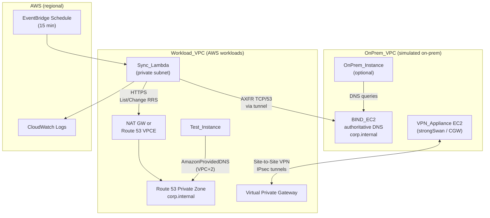
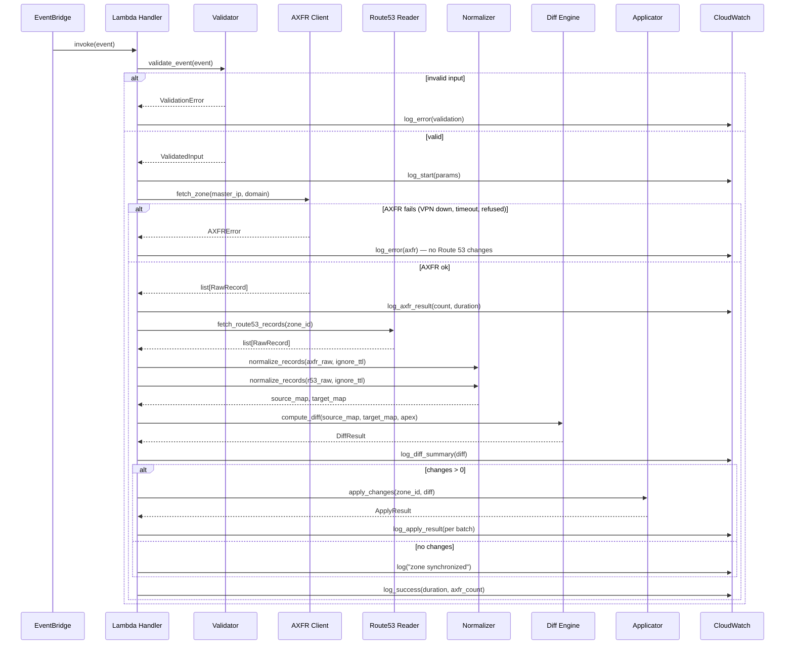

# Design Document: BIND-to-Route 53 Mirror Demo

## Overview

This design describes a **hybrid DNS mirroring demo** that keeps a Route 53 private hosted zone synchronized with a BIND master. The demo uses **two VPCs** connected by **AWS Site-to-Site VPN** to simulate on-premises DNS authority and AWS workload resolution—the same connectivity pattern used in production, without physical datacenter hardware.

| Layer | Responsibility |
| --- | --- |
| **Infrastructure** | OnPrem_VPC (BIND_EC2, VPN_Appliance) ↔ Site-to-Site VPN ↔ Workload_VPC (VGW, Sync_Lambda, Test_Instance, Route53_Zone) |
| **Sync runtime** | Python 3.14 Lambda: AXFR over VPN → normalize → diff → batched Route 53 API writes |
| **Validation** | OnPrem_Instance (optional) queries BIND directly; Test_Instance queries AmazonProvidedDNS (Route 53 mirror only) |

The Sync_Lambda pipeline:

1. Pulls the full zone via AXFR from BIND_EC2 private IP across the VPN tunnel.
2. Reads the current state of the Route 53 private hosted zone (API via NAT or VPC endpoint—not over VPN).
3. Normalizes both record sets to a common representation.
4. Computes a minimal diff (CREATE / UPSERT / DELETE).
5. Applies changes in batched `ChangeResourceRecordSets` calls, or skips the API when the diff is empty.

EventBridge schedules Sync_Lambda every **15 minutes** by default.

### Design Decisions

| Decision | Rationale | Requirement |
| --- | --- | --- |
| Two VPCs + Site-to-Site VPN (not peering) | Mirrors production hybrid connectivity; AXFR crosses an encrypted tunnel | Req 6, 10 |
| BIND on EC2 in OnPrem_VPC | Editable zone files for demo validation; stable private IP as `MasterDns` | Req 7 |
| VPN appliance EC2 as Customer Gateway | Simulates on-prem firewall/router terminating IPsec toward AWS VGW | Req 10 |
| VGW on Workload_VPC (not Transit Gateway) | Simpler lab stack; TGW is a non-goal | Non-Goals |
| Python 3.14 | Latest Lambda-supported Python; `dnspython` for AXFR; boto3 in deployment bundle; runtime identifier `python3.14` | — |
| Full AXFR (not IXFR) | No state between invocations; fine for demo-scale zones | Non-Goals |
| Single Lambda per zone per invocation | Easy idempotency at demo scale | Req 5.5 |
| Normalization as pure functions | Property-based testing of trailing dots, TXT quoting, CNAME conflicts | Req 3 |
| Batches ≤ 1000 changes | Route 53 API hard limit | Req 5.1 |
| Route 53 API via NAT or interface endpoint | Control-plane traffic stays in AWS; does not use VPN bandwidth | Req 10.6 |
| Test_Instance uses AmazonProvidedDNS only | Proves mirroring, not DNS forwarding over VPN | Req 14.4 |

---

## Architecture

### Topology



### VPC and CIDR Layout (reference)

Non-overlapping CIDRs are required (Req 6.1, 10.3–10.4). Example allocation:

| VPC | Example CIDR | Key subnets |
| --- | --- | --- |
| OnPrem_VPC | `10.0.0.0/16` | BIND subnet `10.0.1.0/24`, VPN appliance subnet `10.0.2.0/24` |
| Workload_VPC | `10.1.0.0/16` | Lambda subnet `10.1.1.0/24`, Test_Instance subnet `10.1.2.0/24` |

`MasterDns` EventBridge payload = BIND_EC2 private IP (e.g. `10.0.1.10`).

### Traffic Paths

| Flow | Path | Notes |
| --- | --- | --- |
| AXFR | Sync_Lambda → VGW → VPN tunnel → VPN_Appliance → BIND_EC2:53 | Source IP = Lambda ENI in Workload_VPC subnet; BIND `allow-transfer` restricts to this CIDR |
| Route 53 API | Sync_Lambda → NAT GW or `com.amazonaws.region.route53` VPCE | Does **not** traverse VPN (Req 10.6) |
| Workload DNS query | Test_Instance → AmazonProvidedDNS → Route53_Zone | No route to BIND required (Req 10.7, 14.4) |
| On-prem DNS query | OnPrem_Instance → BIND_EC2 | Immediate after zone reload; bypasses sync (Req 8) |

### Infrastructure Components

| Component | VPC | Purpose | Key config |
| --- | --- | --- | --- |
| **BIND_EC2** | OnPrem | Authoritative master for `corp.internal` | `allow-transfer { Lambda subnet CIDR; };`, SG: TCP 53 from Lambda CIDR only |
| **VPN_Appliance** | OnPrem | Terminates Site-to-Site VPN (Customer Gateway) | Public IP for CGW; routes Workload_VPC CIDR to tunnel |
| **Virtual_Private_Gateway** | Workload | AWS VPN endpoint | Attached to Workload_VPC; propagates OnPrem CIDR routes |
| **Site_to_Site_VPN** | — | Encrypted connectivity | ≥1 tunnel `UP` before validation (Req 10.2) |
| **Sync_Lambda** | Workload | Zone mirror job | VPC-attached; execution role per Req 11 |
| **Route53_Zone** | Workload (association) | Private mirror of `corp.internal` | Not associated with OnPrem_VPC (Req 15) |
| **Test_Instance** | Workload | End-to-end resolution test | Default VPC resolver; `dig` / `nslookup` |
| **OnPrem_Instance** | OnPrem | Optional authoritative-side check | Resolver = BIND_EC2 private IP |
| **EventBridge_Schedule** | — | Triggers sync | Payload: `{Domain, MasterDns, ZoneId, IgnoreTTL}` |
| **NAT Gateway** or **Route 53 VPCE** | Workload | Lambda egress to Route 53 API | Required unless Lambda uses public subnet with IGW (not recommended) |

**Explicitly excluded:** VPC peering between OnPrem_VPC and Workload_VPC (Req 6.5).

### BIND Configuration (reference)

```bind
zone "corp.internal" {
    type master;
    file "/var/named/corp.internal.zone";
    allow-transfer { 10.1.1.0/24; };  // Sync_Lambda subnet CIDR only
    allow-query { any; };              // OnPrem_Instance queries BIND directly
};
```

### IAM (Sync_Lambda execution role)

Scoped permissions only (Req 11):

- `route53:ListResourceRecordSets`, `route53:ChangeResourceRecordSets` on target zone ARN
- `ec2:CreateNetworkInterface`, `ec2:DescribeNetworkInterfaces`, `ec2:DeleteNetworkInterface`
- `logs:CreateLogGroup`, `logs:CreateLogStream`, `logs:PutLogEvents`

---

## Sync Pipeline Architecture

### Data Flow

1. **EventBridge** fires on schedule, passing `{Domain, MasterDns, ZoneId, IgnoreTTL}`.
2. **Validator** rejects bad input before any network I/O (Req 13).
3. **AXFR client** connects to BIND_EC2 over VPN; logs record count on success (Req 1.5).
4. **Route 53 reader** paginates `ListResourceRecordSets`.
5. **Normalizer** converts both sides to keyed `RecordSet` maps (trailing dot, TXT join, type filter).
6. **Diff engine** computes CREATE/UPSERT/DELETE; excludes apex NS and SOA; detects CNAME conflicts; empty diff skips API (Req 4.8).
7. **Applicator** batches changes (≤1000 per call) or no-ops when diff is empty (Req 5.4).
8. **Logger** emits structured logs including duration, batch counts, and stage-specific failures (Req 16).
9. **Test_Instance** in Workload_VPC resolves via AmazonProvidedDNS after Propagation_Delay (Req 14).

### Component Interaction Sequence



---

## Components and Interfaces

### 1. Lambda Handler (`handler.py`)

**Responsibility:** Orchestrates the sync pipeline — validation, AXFR, Route 53 read, normalize, diff, apply, log.

```python
def lambda_handler(event: dict, context) -> dict:
    """
    Entry point. Validates event, runs sync pipeline, returns summary.
    On AXFR or Route 53 write failure: non-zero exit, Route 53 unchanged
    since last successful run (Req 17.1).
    """
```

**Inputs:** EventBridge JSON `{"Domain": str, "MasterDns": str, "ZoneId": str, "IgnoreTTL": bool}`

**Outputs:** `{"status": "success"|"error", "creates": int, "upserts": int, "deletes": int, "duration_ms": int, "message": str}`

---

### 2. Input Validator (`validator.py`)

**Responsibility:** Validates Lambda event parameters before any network call (Req 13).

```python
def validate_event(event: dict) -> ValidatedInput:
    """
    Returns ValidatedInput dataclass or raises ValidationError.
    Checks: Domain is valid DNS name, MasterDns is IPv4/IPv6 (BIND_EC2 IP),
    ZoneId matches /^Z[A-Z0-9]{10,32}$/, IgnoreTTL is bool.
    """
```

---

### 3. AXFR Client (`axfr_client.py`)

**Responsibility:** Full zone transfer from BIND_EC2 over VPN; returns parsed records.

```python
def fetch_zone(master_ip: str, domain: str, timeout: int = 30) -> list[RawRecord]:
    """
    Performs AXFR using dnspython to master_ip:53.
    Raises AXFRError on timeout, connection refused, or transfer refused
    (VPN down, wrong allow-transfer, SG block).
    """
```

**Dependencies:** `dnspython`

---

### 4. Route 53 Reader (`route53_reader.py`)

**Responsibility:** Retrieves all record sets from Route53_Zone (Req 2).

```python
def fetch_route53_records(zone_id: str) -> list[RawRecord]:
    """
    Paginates ListResourceRecordSets. Returns list of RawRecord tuples.
    Raises Route53ReadError on API failure.
    """
```

**Dependencies:** `boto3` (via NAT or Route 53 VPC endpoint)

---

### 5. Normalizer (`normalizer.py`)

**Responsibility:** Pure-function conversion to comparable `RecordSet` objects (Req 3).

```python
def normalize_records(
    raw_records: list[RawRecord],
    ignore_ttl: bool,
    allowed_types: set[str] = SYNC_TYPES
) -> dict[RecordKey, RecordSet]:
    """
    Normalizes names (trailing dot), TXT data (join splits, strip quotes),
    filters to allowed types, skips malformed with warnings.
    Returns keyed dict for O(1) lookup.
    """
```

---

### 6. Diff Engine (`diff_engine.py`)

**Responsibility:** Pure-function diff; CNAME conflict detection (Req 4).

```python
def compute_diff(
    source: dict[RecordKey, RecordSet],
    target: dict[RecordKey, RecordSet],
    zone_apex: str
) -> DiffResult:
    """
    Returns DiffResult with creates, upserts, deletes, conflicts.
    Excludes apex NS, SOA. Empty diff => no ChangeResourceRecordSets call.
    """
```

---

### 7. Change Applicator (`applicator.py`)

**Responsibility:** Batched Route 53 writes (Req 5).

```python
def apply_changes(zone_id: str, diff: DiffResult, batch_size: int = 1000) -> ApplyResult:
    """
    No-op when diff is empty. Otherwise batches and calls
    ChangeResourceRecordSets. Raises ApplyError on API failure.
    """
```

---

### 8. Logger (`sync_logger.py`)

**Responsibility:** Structured logging per Req 16.

```python
def log_start(params: ValidatedInput) -> None
def log_axfr_result(record_count: int, duration_ms: int) -> None
def log_diff_summary(diff: DiffResult) -> None
def log_apply_batch(batch_index: int, creates: int, upserts: int, deletes: int) -> None
def log_success(total_duration_ms: int, axfr_count: int) -> None
def log_warning(message: str, record_name: str, record_type: str) -> None
def log_error(stage: str, error: Exception) -> None  # stage: validation|vpn|axfr|r53_read|r53_write
```

---

## Data Models

### RecordKey

Composite key for O(1) diff lookup.

```python
@dataclass(frozen=True)
class RecordKey:
    name: str       # FQDN with trailing dot, e.g. "app.corp.internal."
    rtype: str      # Uppercase: A, AAAA, CNAME, MX, TXT, SRV, PTR
```

### RecordSet

```python
@dataclass(frozen=True)
class RecordSet:
    key: RecordKey
    ttl: int
    values: frozenset[str]      # Sorted, normalized rdata values
```

### RawRecord

```python
@dataclass
class RawRecord:
    name: str
    rtype: str
    ttl: int
    rdata: list[str]
```

### ValidatedInput

```python
@dataclass(frozen=True)
class ValidatedInput:
    domain: str         # e.g. "corp.internal"
    master_dns: str     # BIND_EC2 private IP in OnPrem_VPC
    zone_id: str        # Route 53 hosted zone ID
    ignore_ttl: bool
```

### DiffResult

```python
@dataclass
class DiffResult:
    creates: list[RecordSet]
    upserts: list[RecordSet]
    deletes: list[RecordKey]
    conflicts: list[tuple[str, str, str]]  # (name, source_type, target_type)
```

### ApplyResult

```python
@dataclass
class ApplyResult:
    creates_applied: int
    upserts_applied: int
    deletes_applied: int
    batches_sent: int
```

### Constants

```python
SYNC_TYPES: set[str] = {"A", "AAAA", "CNAME", "MX", "TXT", "SRV", "PTR"}
MAX_BATCH_SIZE: int = 1000
DEFAULT_TIMEOUT: int = 30       # AXFR seconds
DEFAULT_SYNC_INTERVAL_MIN: int = 15
```

---

## Correctness Properties

*Properties bridge human-readable requirements and machine-verifiable guarantees for the pure-function sync layers.*

### Property 1: Normalization produces valid RecordSets

*For any* raw DNS records from AXFR or Route 53, normalization SHALL produce RecordSets with FQDN names (trailing dot), allowed types, non-negative TTL, and non-empty value sets.

**Validates: Requirements 1.2, 2.2**

### Property 2: Trailing dot normalization is idempotent

*For any* DNS name, normalizing twice yields the same FQDN with exactly one trailing dot.

**Validates: Requirements 3.1**

### Property 3: TXT normalization round-trip consistency

Semantically equivalent TXT strings (differing only in quoting/splitting) normalize to the same value.

**Validates: Requirements 3.2**

### Property 4: Record equality respects IgnoreTTL setting

Same name/type/data with different TTL: equal when IgnoreTTL=true, unequal when false.

**Validates: Requirements 3.3, 3.4, 3.5**

### Property 5: Diff creates equals source minus target

CREATE = keys in AXFR source not in Route 53 target (allowed types; exclude apex NS, SOA).

**Validates: Requirements 4.1**

### Property 6: Diff upserts equals changed intersection

UPSERT = keys in both with differing values/TTL per IgnoreTTL setting.

**Validates: Requirements 4.2**

### Property 7: Diff deletes equals target minus source

DELETE = keys in Route 53 target not in AXFR source.

**Validates: Requirements 4.3**

### Property 8: Diff output type filtering

All operations use only SYNC_TYPES; no apex NS or SOA.

**Validates: Requirements 4.4, 4.5, 4.6**

### Property 9: CNAME conflict detection

CNAME in source vs different type at same name in target → conflict logged, record skipped.

**Validates: Requirements 4.7**

### Property 10: Empty diff skips Route 53 writes

*For any* diff with zero creates, upserts, and deletes, the applicator SHALL NOT call `ChangeResourceRecordSets`.

**Validates: Requirements 4.8**

### Property 11: Change batch size limit

Batching produces ≤1000 changes per batch; union of batches equals full change set.

**Validates: Requirements 5.1**

### Property 12: Diff idempotency

Diff of identical source and target yields zero operations; second sync run produces no API changes.

**Validates: Requirements 5.5**

### Property 13: Input validation correctness

Valid domains, IPs, zone IDs accepted; invalid rejected—never swapped.

**Validates: Requirements 13.1, 13.2, 13.3**

### Property 14: Malformed record exclusion preserves valid records

Malformed raw records excluded with warnings; all well-formed records retained.

**Validates: Requirements 1.4**

---

## Error Handling

### Error Categories and Responses

| Stage | Error | Response | Route 53 state | Exit |
| --- | --- | --- | --- | --- |
| Input Validation | Missing/invalid Domain, MasterDns, ZoneId | Log field-level validation error | Unchanged | Non-zero |
| VPN / Network | Tunnel down, no route to BIND | Log axfr/vpn error with MasterDns | Unchanged (Req 17.1, 17.3) | Non-zero |
| AXFR | Timeout / connection refused / transfer refused | Log BIND IP, timeout, refusal reason | Unchanged | Non-zero |
| AXFR | Malformed record | Log warning per record; exclude; continue | Partial sync of valid records | Continue |
| Route 53 Read | API error / throttling | Log zone ID and error code | Unchanged | Non-zero |
| Diff | CNAME conflict | Log conflict; skip record | Other records still synced | Continue |
| Route 53 Write | `ChangeResourceRecordSets` failure | Log batch index and failed changes | Prior successful batches may have applied* | Non-zero |

\*Route 53 applies each change batch atomically; a mid-run batch failure may leave partial updates. The next successful sync converges toward BIND state. Document as a production gap (Req 18.6).

### Fail-Safe Principles

1. **AXFR failure never deletes Route 53 records** — Pipeline halts before diff when transfer fails (Req 17.1).
2. **VPN down = AXFR fails, last mirror served** — Workload_VPC keeps resolving stale Route 53 data (Req 17.3–17.4).
3. **Partial AXFR parse does not block sync** — Valid records still sync (Req 1.4).
4. **CNAME conflicts skipped, not forced** — Avoids invalid DNS state (Req 4.7).
5. **Stateless invocations** — Next EventBridge run retries from scratch (Req 17.2).
6. **Empty diff is success** — Log "zone synchronized"; no API call (Req 5.4).

### Timeout Configuration

| Setting | Value | Notes |
| --- | --- | --- |
| AXFR TCP timeout | 30 s | Configurable; VPN adds latency budget |
| Lambda timeout | 300 s | Large zones |
| Route 53 API | boto3 default (~60 s) | Via NAT or VPCE |

---

## Demo Validation Workflow

Aligns with Requirements 14 and 18.

| Step | Action | Expected result |
| --- | --- | --- |
| 1 | Verify Site-to-Site VPN tunnel `UP` | Req 10.2 |
| 2 | SSH to BIND_EC2; add/change A record; `rndc reload` | Zone file updated |
| 3 | (Optional) Query from OnPrem_Instance using BIND as resolver | Immediate new answer (Req 8) |
| 4 | Wait Sync_Interval + execution time | Document Propagation_Delay |
| 5 | Query same name from Test_Instance via AmazonProvidedDNS | Answer matches BIND (Req 14) |
| 6 | Check CloudWatch Logs | Start params, AXFR count, change counts, duration (Req 16) |
| 7 | Delete record on BIND; repeat steps 4–5 | NXDOMAIN or empty on Test_Instance (Req 14.3) |

**Cost reminder:** VPN ~$0.05/hr (~$1.20/day) while provisioned; tear down stack when idle (Req 18.5).

---

## Testing Strategy

### Testing Approach

1. **Property-based tests** — Normalizer, diff engine, validator, batcher (Hypothesis).
2. **Unit tests** — Handler orchestration, mocked AXFR/Route 53, logger stages.
3. **Integration tests** — Full pipeline with moto-mocked Route 53.
4. **Live demo tests (optional)** — Deploy two-VPC + VPN stack; run validation workflow above.

### Property-Based Testing

**Library:** [Hypothesis](https://hypothesis.readthedocs.io/)

**Configuration:**
- Minimum 100 examples per property
- Tag: `# Feature: bind-to-route53-mirror-demo, Property {N}: {title}`

**Targets:**

| Module | Properties |
| --- | --- |
| `normalizer.py` | 1, 2, 3, 4, 14 |
| `diff_engine.py` | 5, 6, 7, 8, 9, 10, 12 |
| `applicator.py` | 11 |
| `validator.py` | 13 |

### Unit Tests (Example-Based)

| Component | Test Focus |
| --- | --- |
| `handler.py` | Orchestration, error propagation, empty diff no-op, exit codes |
| `axfr_client.py` | Mocked dnspython: success, timeout, refused transfer |
| `route53_reader.py` | Pagination, API errors |
| `applicator.py` | Batching, empty diff skip, mid-batch failure |
| `sync_logger.py` | All log stages including vpn/axfr/r53_write |

### Integration Tests

| Type | Scope |
| --- | --- |
| **Mocked (moto)** | Full Lambda pipeline; Route 53 create/update/delete |
| **Live (optional)** | VPN UP → BIND change → wait → `dig` from Test_Instance; tunnel-down AXFR failure |

### Test File Organization

```
tests/
├── conftest.py
├── generators.py
├── test_normalizer.py       # Properties 1–4, 14
├── test_diff_engine.py      # Properties 5–10, 12
├── test_batcher.py          # Property 11
├── test_validator.py        # Property 13
├── test_handler.py
├── test_axfr_client.py
├── test_route53_reader.py
├── test_applicator.py
└── integration/
    └── test_full_sync.py
```

### Running Tests

```bash
pytest tests/ -v
pytest tests/test_normalizer.py tests/test_diff_engine.py tests/test_batcher.py tests/test_validator.py -v
pytest tests/ -v --hypothesis-show-statistics
```

---

## Requirements Traceability

| Requirement | Design section |
| --- | --- |
| 1 Zone transfer | AXFR Client, Property 14, Error Handling |
| 2 Route 53 read | Route 53 Reader |
| 3 Normalization | Normalizer, Properties 2–4 |
| 4 Diff | Diff Engine, Properties 5–10 |
| 5 Apply changes | Applicator, Property 11–12 |
| 6 Two-VPC topology | Demo Stack Architecture |
| 7 BIND on EC2 | Infrastructure Components, BIND config |
| 8 OnPrem client | Demo Validation Workflow step 3 |
| 9 BIND ACLs | BIND config `allow-transfer` |
| 10 Site-to-Site VPN | Demo Stack Architecture, Traffic Paths |
| 11 IAM | Infrastructure Components |
| 12 Schedule | Overview, EventBridge in architecture |
| 13 Input validation | Validator, Property 13 |
| 14 Workload DNS validation | Demo Validation Workflow |
| 15 Route 53 zone | Infrastructure Components |
| 16 Observability | Logger interface, sequence diagram |
| 17 Failure behavior | Error Handling, Fail-Safe Principles |
| 18 Documentation | Demo Validation Workflow, cost note |

---

## Open Design Questions

(Mirrors requirements open questions; resolve before implementation.)

- OnPrem_Instance required or optional in default stack?
- Manual "sync now" EventBridge test invoke in addition to schedule?
- Default `IgnoreTTL`: `true` or `false`?
- VPN_Appliance and BIND on same EC2 or separate instances?
- CloudWatch alarms for tunnel down / failed invocations?
