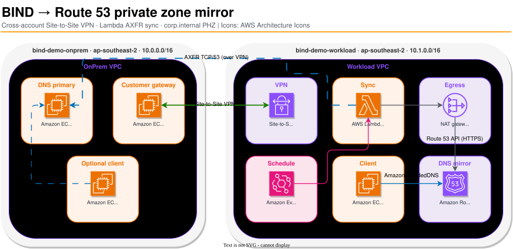
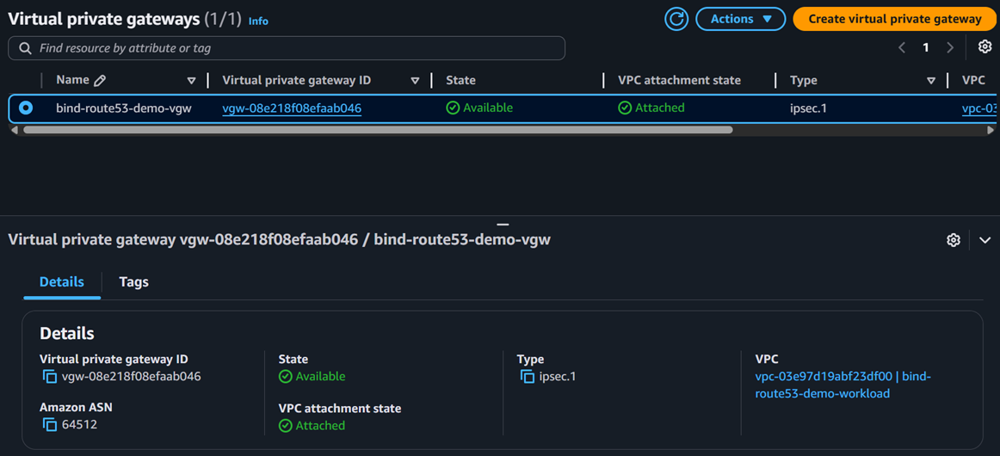
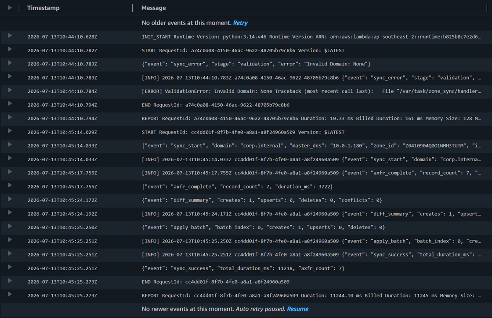
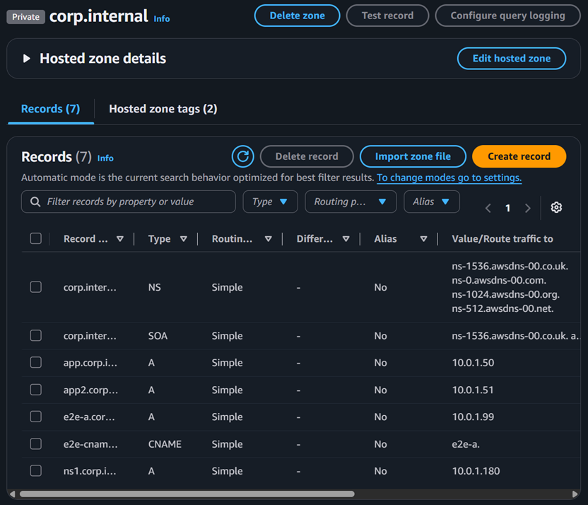

# Walkthrough: BIND → Route 53 private zone mirror

Operator path for the hybrid DNS demo: edit BIND on the simulated on-prem account, sync over Site-to-Site VPN, resolve from the workload VPC via Route 53.



Editable source: [`architecture.drawio`](diagrams/architecture.drawio) · [AWS Icons](https://jajera.github.io/aws-icons)

Deep reference: [DEPLOYMENT.md](DEPLOYMENT.md) · [RUNBOOK.md](RUNBOOK.md) · [ARCHITECTURE.md](ARCHITECTURE.md)

## What you prove

| Step | Proof |
| --- | --- |
| VPN | At least one tunnel `UP` |
| BIND authority | Record answers immediately on BIND after `rndc reload` |
| Sync | Lambda returns `"status": "success"`; CloudWatch shows `axfr_complete` / `sync_success` |
| Workload DNS | `dig` on the test instance returns the mirrored A record via AmazonProvidedDNS |

## Prerequisites

- Profiles: `bind-demo-onprem`, `bind-demo-workload`
- Region: `ap-southeast-2`
- Terraform ≥ 1.5, Session Manager plugin, Python 3.14 (local tests only)

```bash
export AWS_REGION=ap-southeast-2
aws --profile bind-demo-onprem sts get-caller-identity
aws --profile bind-demo-workload sts get-caller-identity
```

## 1. Deploy

```bash
./scripts/deploy_stacks.sh
```

Wait 1–2 minutes for SSM **Online** on BIND, VPN appliance, and the workload test instance.

Capture outputs (IDs change every deploy):

```bash
terraform -chdir=infra/terraform/onprem output
terraform -chdir=infra/terraform/workload output
```

Useful values: `bind_instance_id`, `bind_private_ip`, `vpn_connection_id`, `sync_lambda_name`, `route53_zone_id`, `test_instance_id`.

Tear down when idle (`./scripts/destroy_stacks.sh`) — Site-to-Site VPN dominates cost (~$1.20/day).

## 2. Confirm the VPN tunnel

```bash
aws --profile bind-demo-workload ec2 describe-vpn-connections \
  --vpn-connection-ids "$(terraform -chdir=infra/terraform/workload output -raw vpn_connection_id)" \
  --query 'VpnConnections[0].VgwTelemetry[].{OutsideIp:OutsideIpAddress,Status:Status}' \
  --output table
```

**Pass:** at least one tunnel `UP` (the second may stay `DOWN` in this demo).

Example from a verified run:

```text
-----------------------------------------------
|          DescribeVpnConnections             |
+------------------+-----------------+--------+
|     OutsideIp    |     Status      |        |
+------------------+-----------------+--------+
|  13.54.219.69    |  UP             |        |
|  32.237.19.152   |  DOWN           |        |
+------------------+-----------------+--------+
```

If both are `DOWN`, see [RUNBOOK.md — VPN tunnel down](RUNBOOK.md#vpn-tunnel-down).

Workload VGW attached to the demo VPC (console):



## 3. Change DNS on BIND

```bash
aws --profile bind-demo-onprem ssm start-session \
  --target "$(terraform -chdir=infra/terraform/onprem output -raw bind_instance_id)"
```

On the instance:

```bash
sudo vim /var/named/corp.internal.zone
```

Add or change an A record (and bump the SOA serial, e.g. `YYYYMMDDNN`):

```dns
walk  IN  A  10.0.1.77
```

Reload:

```bash
sudo rndc reload
sudo rndc status
dig @127.0.0.1 walk.corp.internal A +short
# Expected: 10.0.1.77
```

Exit the SSM session when done (`exit`).

## 4. Sync now (Lambda)

From your laptop (not inside SSM):

```bash
aws --profile bind-demo-workload lambda invoke \
  --function-name "$(terraform -chdir=infra/terraform/workload output -raw sync_lambda_name)" \
  --cli-binary-format raw-in-base64-out \
  --payload '{"Domain":"corp.internal","MasterDns":"'"$(terraform -chdir=infra/terraform/workload output -raw bind_private_ip)"'","ZoneId":"'"$(terraform -chdir=infra/terraform/workload output -raw route53_zone_id)"'","IgnoreTTL":true}' \
  /tmp/sync-out.json && cat /tmp/sync-out.json
```

**Pass:** JSON like:

```json
{"status": "success", "creates": 1, "upserts": 0, "deletes": 0, "duration_ms": 9982, "axfr_count": 8, "message": "Zone synchronized"}
```

(`creates` / `upserts` / `axfr_count` depend on what you changed; a no-op re-sync shows zeros.)

Optional CloudWatch check:

```bash
aws --profile bind-demo-workload logs filter-log-events \
  --log-group-name "/aws/lambda/$(terraform -chdir=infra/terraform/workload output -raw sync_lambda_name)" \
  --filter-pattern "axfr_complete" \
  --limit 3
```

Example structured events:

```json
{"event": "sync_start", "domain": "corp.internal", "master_dns": "10.0.1.180", "zone_id": "Z0410904Q0O1WMH3TUTM", "ignore_ttl": true}
{"event": "axfr_complete", "record_count": 7, "duration_ms": 3625}
```

CloudWatch Logs for a successful run (`axfr_complete` → `diff_summary` → `sync_success`):



Or wait for EventBridge (default every 15 minutes) instead of invoking manually.

## 5. Resolve from the workload VPC

Echo the dig **before** starting SSM (env does not carry into the session):

```bash
echo 'dig walk.corp.internal A +short'
aws --profile bind-demo-workload ssm start-session \
  --target "$(terraform -chdir=infra/terraform/workload output -raw test_instance_id)"
```

On the test instance:

```bash
dig walk.corp.internal A +short
# Expected: 10.0.1.77

dig walk.corp.internal A +short @169.254.169.253
# Same answer via AmazonProvidedDNS → Route 53 PHZ
```

Verified dig against an existing mirrored record (`app.corp.internal` → `10.0.1.50`), answering from the VPC resolver (`10.1.0.2`):

```text
;; ANSWER SECTION:
app.corp.internal.	299	IN	A	10.0.1.50
;; SERVER: 10.1.0.2#53(10.1.0.2) (UDP)
```

API check from your laptop (no SSM):

```bash
aws --profile bind-demo-workload route53 list-resource-record-sets \
  --hosted-zone-id "$(terraform -chdir=infra/terraform/workload output -raw route53_zone_id)" \
  --query "ResourceRecordSets[?Name=='walk.corp.internal.']" \
  --output table
```

Mirrored records in the `corp.internal` private hosted zone (console):



## Demo narrative (talk track)

1. **On-prem is authoritative** — BIND holds `corp.internal`; workload does not talk to BIND for day-to-day queries.
2. **VPN is the data plane for AXFR** — Lambda reaches BIND private IP over the tunnel; Route 53 API does **not** use the VPN (NAT → HTTPS).
3. **Mirror, not dual-write** — change BIND → sync → Route 53 catches up; deletes/updates behave the same after the next successful run.
4. **Stale is expected on failure** — if VPN/AXFR/API fails, Route 53 keeps the last good snapshot until sync succeeds again.

## Optional extras

| Extra | How |
| --- | --- |
| On-prem dig before sync | Deploy with `-var='enable_onprem_test_instance=true'`, dig `@<bind_private_ip>` from that host |
| AXFR ACL proof | From test instance: `dig @<bind_private_ip> corp.internal AXFR` → transfer failed; only Lambda subnet `10.1.1.0/24` is allowed |
| Fail sync on purpose | Stop VPN appliance or block TCP/53; invoke Lambda → `sync_error` / CloudWatch Errors alarm |

## Cleanup

```bash
./scripts/destroy_stacks.sh
```

Workload stack is destroyed first so the hosted zone and VPN tear down cleanly.
